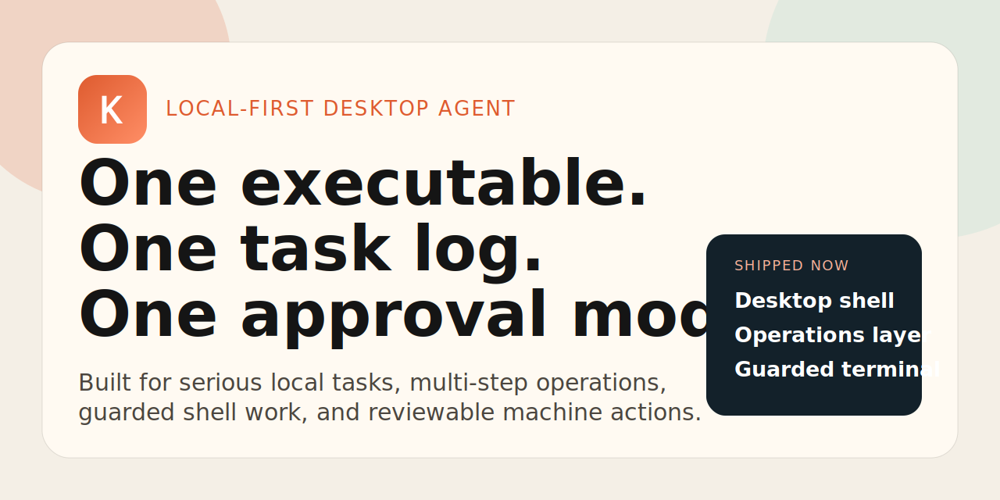

# Klava

`Klava` is a desktop agent built on top of OpenClaw for local work on Windows and macOS.

[](https://github.com/junior2wnw/klava-bot/actions/workflows/ci.yml)
[](https://github.com/junior2wnw/klava-bot/releases/latest)
[](./LICENSE)
[](https://github.com/junior2wnw/klava-bot/issues)
[](https://github.com/junior2wnw/klava-bot/discussions)



Languages: **English** | [README.ru](./README.ru.md)

Klava is a local-first desktop agent for people who need an AI to work on the actual machine, not just answer inside a chat box.

It combines a local runtime, secret storage, approvals, and task history so chat, shell work, and machine changes can be handled in one place.

Quick links:

- [Public site](https://junior2wnw.github.io/klava-bot/)
- [Latest release](https://github.com/junior2wnw/klava-bot/releases/latest)
- [Design partner program](./DESIGN_PARTNERS.md)
- [Apply as a design partner](https://github.com/junior2wnw/klava-bot/issues/new?template=design_partner.md)
- [Launch copy](./LAUNCH_POST.md)

Core idea:

> one desktop app, one task log, one approval model, one tool that can inspect the machine, make approved changes, and record what happened.

This repository is published as a standalone product repository, with its upstream lineage documented explicitly:

- Upstream project: [`OpenClaw`](https://github.com/openclaw/openclaw)
- Upstream boundary in-tree: [forks/openclaw/README.md](./forks/openclaw/README.md)
- Fork and publication notes: [UPSTREAM.md](./UPSTREAM.md)
- Public landing page: [junior2wnw.github.io/klava-bot](https://junior2wnw.github.io/klava-bot/)
- Public landing page (RU): [junior2wnw.github.io/klava-bot/ru/](https://junior2wnw.github.io/klava-bot/ru/)
- Open-source launch and lineage doc: [docs/16_OPEN_SOURCE_AND_FORK_LINEAGE.md](./docs/16_OPEN_SOURCE_AND_FORK_LINEAGE.md)

## Why people pay attention

Klava is trying to occupy a more valuable surface than "AI chat with tools":

- it is local-first instead of assuming a remote control plane;
- risky actions are approval-gated instead of buried inside free-form tool calls;
- it already ships a desktop shell, guarded terminal flow, task transcript, and support bundle export;
- the repo is published like a real product surface, with explicit lineage, docs, releases, and CI.

## Why Klava exists

Most agents stop at suggestions, shell snippets, or browser automation.

Klava is built around a local work loop:

- understand the task;
- inspect the local machine and project state;
- request approval before risky changes;
- execute typed workflows instead of free-form privileged text;
- preserve an audit trail;
- leave behind recovery hints and support bundles.

The goal is a desktop tool that can do work, explain what changed, and leave usable records behind.

## Available today

Available in this repo:

- Electron + React desktop shell;
- local runtime manager with typed HTTP API;
- Pro surface for durable multi-step operations with reviewable steps and progress;
- secure local secret storage with Windows DPAPI protection and local encrypted vault files on macOS/Linux;
- GONKA mainnet onboarding, validation, balance checks, and strongest-model selection;
- task system with transcript history and support bundle export;
- guarded task-local terminal with approval modes;
- desktop packaging through Electron Builder for Windows and macOS.

Commands available now:

- `new task`
- `/terminal <command>`
- `$ <command>`
- `guard strict`
- `guard balanced`
- `guard off`

Chat behavior today:

- normal chat uses GONKA mainnet completion after onboarding;
- guarded commands still respect the approval model;
- terminal results are written back into the same task transcript and terminal history.

Current provider status:

- onboarding, validation, balance checks, and model discovery on GONKA work in this repo state;
- the public GONKA-backed chat path is currently blocked by a provider-side transfer-agent panic tracked in [`gonka-ai/gonka#876`](https://github.com/gonka-ai/gonka/issues/876);
- once that provider-side issue is fixed on the Gonka side, Klava's documented signed `chat/completions` path should be usable again without changing the client architecture.

Current public integration note:

- [GONKA_STATUS.md](./GONKA_STATUS.md)

## New: Operations layer

Klava now has a real `Pro` surface instead of a placeholder tab.

It can stage a multi-step local operation inside one task, keep explicit step status, pause behind approvals, continue one step at a time, and retain the whole runbook in task history.

That means the repo can now honestly show:

- durable multi-step machine work instead of one-shot chat turns;
- custom local runbooks made of notes and terminal commands;
- risky steps that stop inside the same approval model instead of escaping it;
- an operator-facing surface for longer tasks that need structure, not just text generation.

## Looking for design partners

The fastest path from open-source interest to serious traction is a small number of high-value workflows with real stakes.

Klava is actively looking for design partners in areas such as:

- workstation repair and recovery;
- local project migrations between providers or backends;
- internal IT or platform tasks that need approvals and transcripts;
- consultant workflows where one operator repeatedly performs the same risky local changes.

If you have a painful local-machine workflow with real urgency, start here:

- [Apply as a design partner](https://github.com/junior2wnw/klava-bot/issues/new?template=design_partner.md)
- [Read the design partner program](./DESIGN_PARTNERS.md)

## Planned workflow surface

Not every item below is shipped today. Some are already implemented; others are planned extensions for the privileged helper, cloud modules, and workflow packs described in the docs.

The same runtime should eventually cover workflows such as:

- inspect a broken workstation, prepare a restore point, reinstall a GPU, audio, or network driver, validate the device state, and explain what changed;
- replace a BaaS dependency in a local project, rewrite env/config files, update adapters, run smoke checks, and leave a diff summary;
- switch a project from one inference provider to another, update local runtime settings, test the new path, and roll back if health checks fail;
- bootstrap a new developer machine from a single desktop app: install toolchains, clone repos, set environment, verify services, and leave the machine ready to work;
- repair a damaged local development environment by checking `PATH`, shell profiles, startup tasks, Docker/WSL state, and service health;
- rotate local secrets out of `.env` files into a vault-backed setup without leaking values into transcripts or logs;
- reset network adapters, reconfigure firewall rules through approved typed flows, and validate the resulting connectivity;
- collect logs, crash state, config snapshots, and system metadata into a support bundle that another engineer can actually use;
- audit what changed on the machine, who approved it, which helper or runtime version executed it, and what rollback path exists;
- give a non-expert user one desktop app that can move from "my machine is broken" to "the machine is repaired and documented" without making them stitch together five separate tools.

These examples describe direction, not a claim that every workflow is available today.

## Safety model

Klava follows a few strict rules:

- `Work locally by default`: the core desktop loop should not depend on a remote control plane.
- `Keep secrets out of transcripts`: keys belong in the vault, not in chat history.
- `Require explicit approval`: dangerous actions should include impact and rollback context.
- `Use typed privileged flows`: the model should not get a general "run anything as admin" channel.
- `Leave structured records`: important actions should be reviewable later.

If Klava eventually handles driver repair, service surgery, backend replacement, or system recovery, it should do so through typed workflows, not prompt improvisation.

## OpenClaw lineage

Klava started from OpenClaw and diverges in a few clear areas.

What stays close to upstream:

- runtime-first architecture;
- preference for composition over rewrites;
- minimal fork surface where possible;
- modular capability seams instead of giant monolith features.

What is Klava-specific:

- desktop shell and UX;
- onboarding, approvals, and diagnostics;
- packaging and release ergonomics;
- local vault integration;
- product-facing modules and surface registry;
- opinionated security and privileged execution model.

If GitHub does not show a native fork badge for this repository, the lineage is still explicit in-tree through [`UPSTREAM.md`](./UPSTREAM.md) and [`forks/openclaw/README.md`](./forks/openclaw/README.md).

## Repository map

- [`apps/desktop`](./apps/desktop) - Electron shell and UI composition
- [`packages/runtime`](./packages/runtime) - local runtime API and provider integrations
- [`packages/ui`](./packages/ui) - reusable UI building blocks
- [`packages/contracts`](./packages/contracts) - shared types and contracts
- [`docs`](./docs) - product, architecture, security, and execution docs
- [`forks/openclaw`](./forks/openclaw) - explicit upstream boundary

## Documentation

Recommended reading order:

1. [Documentation Index](./docs/00_INDEX.md)
2. [Security and Privileged Execution](./docs/04_SECURITY_AND_PRIVILEGED_EXECUTION.md)
3. [Upstream Sync and Update Strategy](./docs/08_UPSTREAM_SYNC_AND_UPDATE_STRATEGY.md)
4. [Implementation Audit](./docs/14_IMPLEMENTATION_AUDIT.md)
5. [Execution Playbook](./docs/15_EXECUTION_PLAYBOOK.md)
6. [Open Source and Fork Lineage](./docs/16_OPEN_SOURCE_AND_FORK_LINEAGE.md)
7. [Roadmap](./ROADMAP.md)
8. [Governance](./GOVERNANCE.md)
9. [Support](./SUPPORT.md)

## Quick start

### For developers

Requirements:

- `Node.js 24+`

Run:

```bash
npm install
npm run dev
```

What this starts:

- Vite renderer on `http://127.0.0.1:5173`
- Electron desktop shell
- local runtime API on `http://127.0.0.1:4120` started by the desktop process

Build:

```bash
npm run build
```

Desktop release builds:

```bash
npm run dist:win
npm run dist:mac # run this on macOS
```

### For users

Most people should never need the dev stack.

Klava is designed to ship as a desktop app bundle with local runtime included:

- `apps/desktop/release/Klava 0.1.0.exe`
- `apps/desktop/release/*.dmg` when built on macOS
- `apps/desktop/release/mac*/Klava.app` when built on macOS

First use:

1. Launch `Klava`.
2. Connect your provider secret through the secure onboarding flow.
3. Let the app validate and cache provider state.
4. Start operating through tasks, chat, and approvals.

## Verification already completed in this repo state

- `npm run check`
- `npm test`
- `npm run build`
- `npm run dist:win`
- `npm run dist:mac` path added and documented, but not yet validated on a macOS host in this repo state
- GitHub Actions CI runs `npm run check`, `npm test`, and `npm run build` on pushes and pull requests, with an additional Windows desktop build job
- runtime smoke test for `guarded -> approval -> reject`
- runtime smoke test for task creation and guarded terminal approval generation
- runtime smoke test for support bundle export without secret leakage
- runtime smoke test for GONKA onboarding rejection on an account-not-found phrase with provider state staying disconnected
- packaged `Klava 0.1.0.exe` startup smoke test without main-process crash

## Project docs

Klava is published as a working open-source project, not as a source snapshot.

- License: [MIT](./LICENSE)
- Contributing guide: [CONTRIBUTING.md](./CONTRIBUTING.md)
- Code of conduct: [CODE_OF_CONDUCT.md](./CODE_OF_CONDUCT.md)
- Security policy: [SECURITY.md](./SECURITY.md)
- Roadmap: [ROADMAP.md](./ROADMAP.md)
- Governance: [GOVERNANCE.md](./GOVERNANCE.md)
- Support: [SUPPORT.md](./SUPPORT.md)
- Manifesto: [MANIFESTO.md](./MANIFESTO.md)
- Gonka status: [GONKA_STATUS.md](./GONKA_STATUS.md)
- Design partners: [DESIGN_PARTNERS.md](./DESIGN_PARTNERS.md)
- Launch copy: [LAUNCH_POST.md](./LAUNCH_POST.md)

If you want to help, prefer contributions that make the system clearer, safer, or easier to extend.
