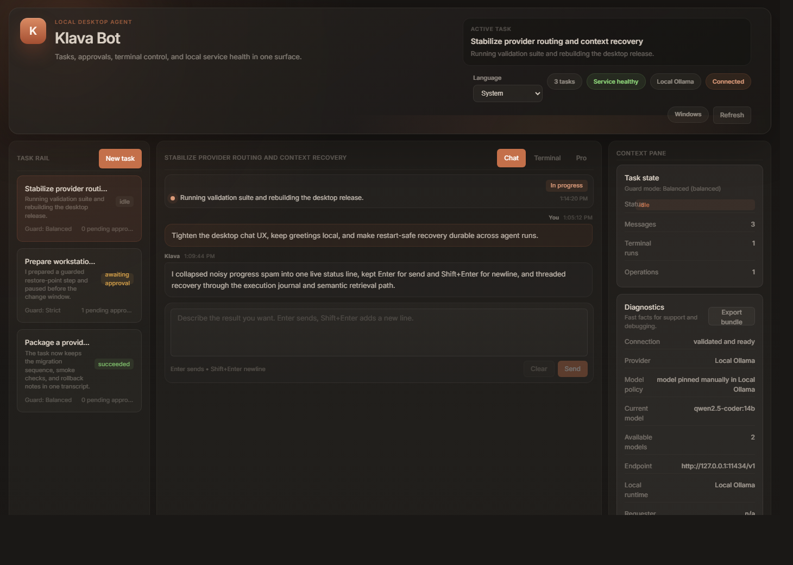

# Klava

`Klava` — это desktop-агент для локальной работы на Windows и macOS, построенный поверх OpenClaw.

[](https://github.com/junior2wnw/klava-bot/releases/latest)
[](./LICENSE)
[](https://github.com/junior2wnw/klava-bot/issues)
[](https://github.com/junior2wnw/klava-bot/discussions)

Languages: [English](./README.md) | **Русский**



Klava — это локальный desktop-агент для ремонта рабочих станций, миграций проекта и провайдера, контролируемой работы в терминале и проверяемых изменений на машине.

Он объединяет локальный рантайм, хранение секретов, подтверждения действий, журнал задач, semantic retrieval, execution journal и restart-safe recovery, чтобы чат, терминал и изменения на машине жили в одном проверяемом контуре.

Скриншот выше снят с реального приложения на безопасном демо-состоянии. Это не иллюстрация и не содержит личной переписки.

Коротко:

> один исполняемый файл, один журнал задач, одна модель подтверждений и один инструмент, который умеет проверить машину, внести согласованные изменения и зафиксировать результат.

## Зачем открывать этот репозиторий

- здесь есть реальная desktop-оболочка, а не только веб-чат;
- рискованные действия проходят через явные подтверждения и guarded terminal flow;
- история задач, support bundles, execution journal и restart-safe resume уже собраны в одну поверхность;
- контекст не режется тупо по последним сообщениям: есть автоматическое сжатие и semantic retrieval по истории и tool outputs;
- типизированные операции и общие контракты можно проверить прямо в коде и тестах.

## Быстрый путь проверки

1. Откройте [последний релиз](https://github.com/junior2wnw/klava-bot/releases/latest) или [публичный сайт](https://junior2wnw.github.io/klava-bot/).
2. Посмотрите [`apps/desktop/src/features/chat/ChatSurface.tsx`](./apps/desktop/src/features/chat/ChatSurface.tsx), [`apps/desktop/src/features/pro/ProSurface.tsx`](./apps/desktop/src/features/pro/ProSurface.tsx), [`packages/runtime/src/semantic-retrieval.ts`](./packages/runtime/src/semantic-retrieval.ts) и [`packages/runtime/src/execution-journal.ts`](./packages/runtime/src/execution-journal.ts).
3. Откройте [`packages/contracts/src/operations.ts`](./packages/contracts/src/operations.ts) и [`packages/runtime/src/server.test.ts`](./packages/runtime/src/server.test.ts), чтобы увидеть модель состояния и runtime proof.
4. Запустите локально:

```bash
npm install
npm run dev
npm run check
```

## Где Klava особенно уместен

- ремонт и восстановление рабочих станций, где нужен rollback до изменений;
- миграции репозитория, BaaS или AI-провайдера с проверками и сводкой результата;
- внутренние IT и platform workflows, где нужны явные approvals и машинные receipts;
- консультантские и support-циклы, которые сейчас размазаны между терминалом, заметками, чатами и памятью человека.

Этот проект опубликован как самостоятельный репозиторий продукта, но связь с upstream указана явно:

- Исходный проект: [`OpenClaw`](https://github.com/openclaw/openclaw)
- Граница с upstream в репозитории: [forks/openclaw/README.md](./forks/openclaw/README.md)
- Пояснение по форку и публикации: [UPSTREAM.md](./UPSTREAM.md)
- Документ по открытому проекту и происхождению форка: [docs/16_OPEN_SOURCE_AND_FORK_LINEAGE.md](./docs/16_OPEN_SOURCE_AND_FORK_LINEAGE.md)
- Публичная landing page: [junior2wnw.github.io/klava-bot](https://junior2wnw.github.io/klava-bot/)
- Русская landing page: [junior2wnw.github.io/klava-bot/ru/](https://junior2wnw.github.io/klava-bot/ru/)

## Зачем нужен Klava

Большинство агентских проектов заканчиваются советами, командой для терминала или автоматизацией браузера.

`Klava` строится вокруг простого локального цикла:

- понять задачу;
- изучить локальную машину и состояние проекта;
- запросить подтверждение перед рискованными действиями;
- выполнять типизированные сценарии вместо свободного привилегированного текста;
- оставлять журнал действий;
- сохранять подсказки для восстановления и пакеты диагностики.

Цель — получить настольный инструмент, который умеет выполнять работу, объяснять изменения и оставлять после себя понятные записи.

## Что уже доступно

В текущем состоянии репозитория уже есть:

- Electron + React desktop shell;
- локальный рантайм с типизированным HTTP API;
- безопасное локальное хранение секретов через Windows DPAPI и локальное зашифрованное хранилище на macOS/Linux;
- подключение к GONKA mainnet, валидация, проверка баланса и выбор доступной модели;
- система задач с историей диалога и экспортом пакета диагностики;
- терминал с режимами подтверждения действий;
- desktop-сборка через Electron Builder для Windows и macOS.

Команды, которые уже есть:

- `new task`
- `/terminal <command>`
- `$ <command>`
- `guard strict`
- `guard balanced`
- `guard off`

Текущее поведение чата:

- обычный чат использует GONKA mainnet completion после onboarding;
- команды с риском по-прежнему проходят через модель подтверждений;
- вывод терминала возвращается в журнал задачи и историю терминала.

Текущий статус провайдера:

- onboarding, валидация, проверка баланса и получение списка моделей для GONKA сейчас работают;
- публичный путь чата через GONKA сейчас заблокирован из-за падения transfer agent на стороне провайдера, которое отслеживается в [`gonka-ai/gonka#876`](https://github.com/gonka-ai/gonka/issues/876);
- после исправления этой проблемы на стороне Gonka документированный подписанный путь `chat/completions` в Klava должен снова заработать без смены клиентской архитектуры.

## Какие сценарии заложены в архитектуру

Не каждый сценарий ниже уже реализован. Часть уже есть в коде, остальное относится к дальнейшему развитию привилегированного помощника, облачных модулей и библиотек типизированных сценариев.

Тот же рантайм должен со временем покрывать такие задачи:

- проверить неисправную рабочую станцию, создать точку восстановления, переустановить видеодрайвер, аудиодрайвер или сетевой драйвер, затем проверить результат и объяснить изменения;
- заменить BaaS в локальном проекте, переписать конфигурацию, обновить адаптеры, прогнать smoke checks и оставить краткую сводку по изменениям;
- переключить проект с одного inference-провайдера на другой, обновить локальные настройки, проверить новый путь и при необходимости откатиться;
- поднять новую машину разработчика из одного исполняемого файла: установить инструменты, клонировать репозитории, настроить окружение, проверить сервисы и оставить машину в рабочем состоянии;
- починить локальное окружение через проверку `PATH`, профилей оболочки, автозапуска, состояния Docker/WSL и сервисов;
- вынести секреты из `.env` в локальное защищённое хранилище без утечки значений в журнал или логи;
- сбросить сетевые адаптеры, перенастроить правила файрвола через согласованные типизированные сценарии и проверить доступность сети;
- собрать логи, состояние после падения, снимки конфигурации и системные метаданные в пакет диагностики, которым сможет пользоваться другой инженер;
- показать, что именно изменилось на машине, кто это подтвердил, какая версия помощника или рантайма это выполнила и как откатить изменения.

Это направление развития, а не утверждение, что все эти сценарии уже доступны сегодня.

## Модель безопасности

Klava строится вокруг нескольких жёстких правил:

- `Локальная работа по умолчанию`: основной цикл не должен зависеть от внешней управляющей SaaS-плоскости.
- `Секреты вне журнала`: ключи должны жить в хранилище, а не в истории чата.
- `Явные подтверждения`: опасные действия должны сопровождаться описанием влияния и отката.
- `Типизированные привилегированные операции`: модель не должна получать общий канал "запусти что угодно с правами администратора".
- `Проверяемость`: важные действия должны оставлять структурированные записи.

Если Klava будет заниматься ремонтом драйверов, заменой backend-провайдера или восстановлением системы, это должно происходить через типизированные сценарии, а не через импровизацию в промпте.

## Происхождение от OpenClaw

Klava вырос из OpenClaw и расходится с ним в нескольких понятных местах.

Что остаётся близким к upstream:

- архитектура, в которой рантайм стоит в центре;
- приоритет композиции вместо полного переписывания;
- минимальная поверхность форка там, где это возможно;
- модульные границы между возможностями вместо больших монолитных функций.

Что является специфичным именно для Klava:

- оболочка и пользовательский интерфейс;
- onboarding, подтверждения и диагностика;
- упаковка и выпуск релизов;
- интеграция с локальным хранилищем секретов;
- продуктовые модули и реестр поверхностей;
- более строгая модель безопасности вокруг привилегированных действий.

Если GitHub не показывает стандартный значок форка, происхождение всё равно явно зафиксировано через [`UPSTREAM.md`](./UPSTREAM.md) и [`forks/openclaw/README.md`](./forks/openclaw/README.md).

## Структура репозитория

- [`apps/desktop`](./apps/desktop) - оболочка Electron и основной интерфейс
- [`packages/runtime`](./packages/runtime) - локальный runtime API и интеграции с провайдерами
- [`packages/ui`](./packages/ui) - переиспользуемые UI-компоненты
- [`packages/contracts`](./packages/contracts) - общие контракты и типы
- [`docs`](./docs) - документация по продукту, архитектуре и безопасности
- [`forks/openclaw`](./forks/openclaw) - явная граница с upstream

## Документация

Рекомендуемый порядок чтения:

1. [Documentation Index](./docs/00_INDEX.md)
2. [Security and Privileged Execution](./docs/04_SECURITY_AND_PRIVILEGED_EXECUTION.md)
3. [Upstream Sync and Update Strategy](./docs/08_UPSTREAM_SYNC_AND_UPDATE_STRATEGY.md)
4. [Implementation Audit](./docs/14_IMPLEMENTATION_AUDIT.md)
5. [Execution Playbook](./docs/15_EXECUTION_PLAYBOOK.md)
6. [Open Source and Fork Lineage](./docs/16_OPEN_SOURCE_AND_FORK_LINEAGE.md)
7. [Roadmap](./ROADMAP.md)
8. [Governance](./GOVERNANCE.md)
9. [Support](./SUPPORT.md)

## Быстрый старт

### Для разработчиков

Требования:

- `Node.js 24+`

Запуск:

```bash
npm install
npm run dev
```

Что поднимется:

- Vite renderer на `http://127.0.0.1:5173`
- Electron desktop shell
- local runtime API на `http://127.0.0.1:4120`, который стартует из desktop process

Сборка:

```bash
npm run build
```

Релизные desktop-сборки:

```bash
npm run dist:win
npm run dist:mac # запускать на macOS
```

### Для пользователей

Большинству людей стек разработки не нужен.

Klava рассчитан на поставку как desktop-приложение со встроенным локальным рантаймом:

- `apps/desktop/release/Klava 0.1.0.exe`
- `apps/desktop/release/*.dmg` при сборке на macOS
- `apps/desktop/release/mac*/Klava.app` при сборке на macOS

Первое использование:

1. Запусти `Klava`.
2. Подключи секрет провайдера через безопасный сценарий первичной настройки.
3. Дай приложению проверить и закэшировать состояние провайдера.
4. Начни работать через задачи, чат и подтверждения.

## Что уже проверено

- `npm run check`
- `npm run build`
- `npm run dist:win`
- runtime smoke test для `guarded -> approval -> reject`
- runtime smoke test для task creation и guarded terminal approval generation
- runtime smoke test для support bundle export без утечки секретов
- runtime smoke test для GONKA onboarding rejection на account-not-found phrase
- packaged `Klava 0.1.0.exe` startup smoke test без main-process crash

## Документы проекта

Klava опубликован как рабочий открытый проект, а не как снимок исходников.

- Лицензия: [MIT](./LICENSE)
- Правила участия: [CONTRIBUTING.md](./CONTRIBUTING.md)
- Кодекс поведения: [CODE_OF_CONDUCT.md](./CODE_OF_CONDUCT.md)
- Политика безопасности: [SECURITY.md](./SECURITY.md)
- Дорожная карта: [ROADMAP.md](./ROADMAP.md)
- Управление проектом: [GOVERNANCE.md](./GOVERNANCE.md)
- Поддержка: [SUPPORT.md](./SUPPORT.md)
- Манифест: [MANIFESTO.md](./MANIFESTO.md)
- Материалы для анонса: [LAUNCH_POST.md](./LAUNCH_POST.md)

Если хочешь помочь, самые полезные изменения — те, которые делают систему понятнее, безопаснее и проще для расширения.
